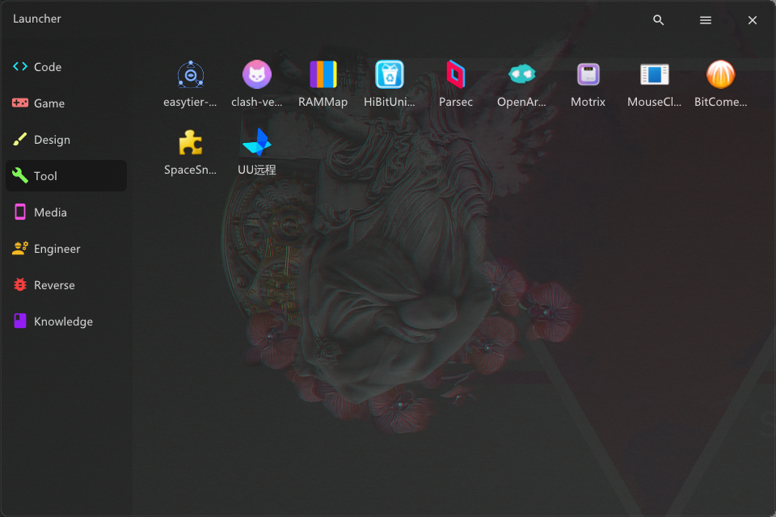
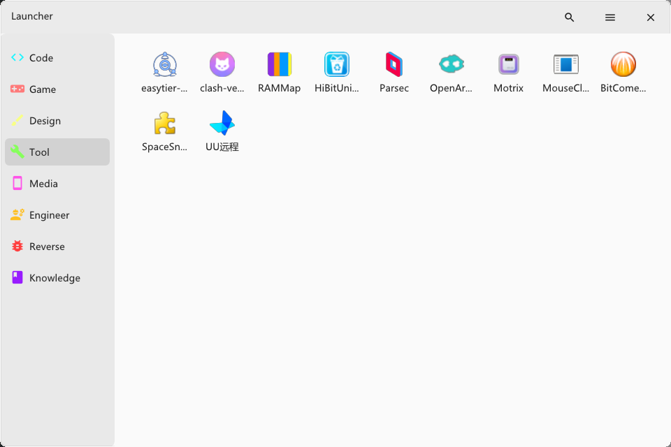
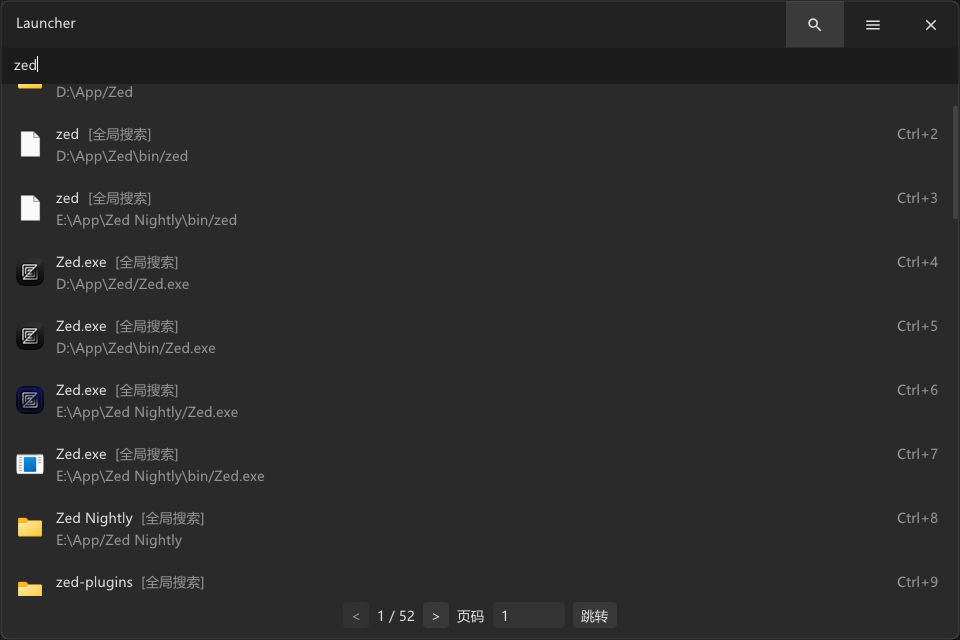
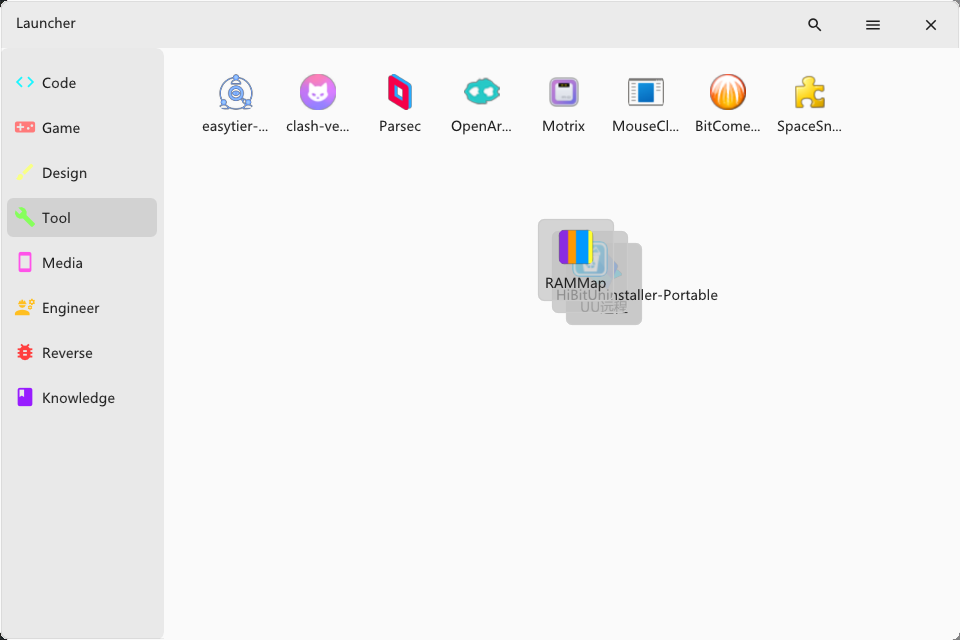
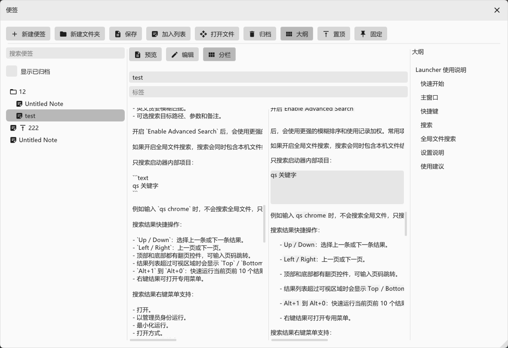
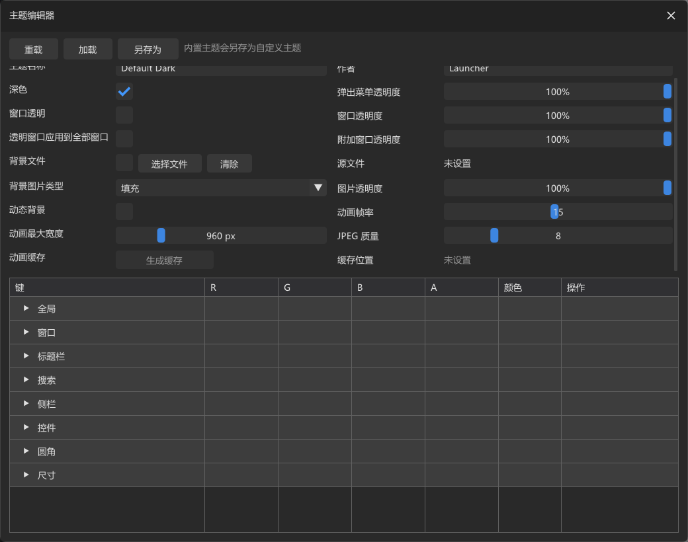
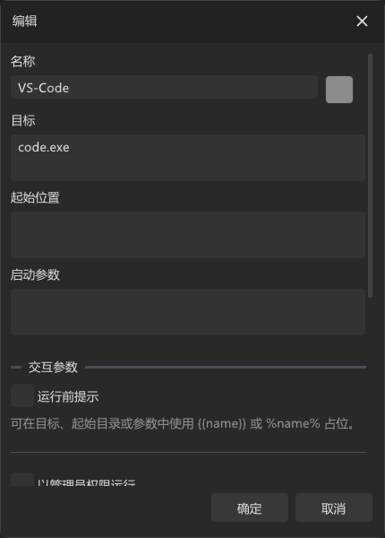
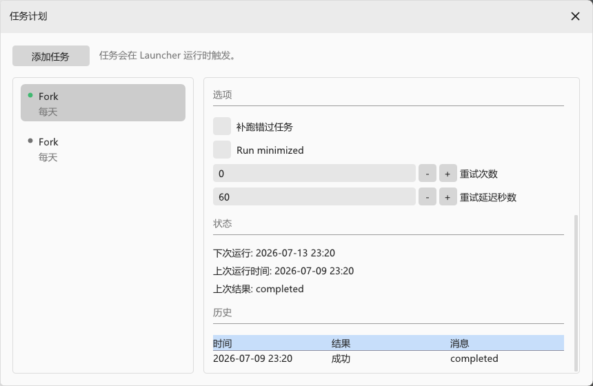

# Launcher

Windows desktop launcher built with C++20, Win32, DirectX 11, and Dear ImGui.

This repository is not just a UI scaffold anymore. It already contains a working launcher shell with persisted configuration, item/category management, search, theme customization, tray behavior, and several Windows integration features.

## Features

- Single-instance Win32 desktop app
- Dear ImGui-based custom launcher UI
- Category-based launcher organization
- Multiple item types, including app, URL, script, title, placeholder, and virtual folder
- Drag-and-drop file import into the current category
- Search with substring, fuzzy, regex, and pinyin-related options
- Tray/minimize behavior and global hotkey support
- Theme editor, settings panel, and background image support
- Markdown notes with image attachments, scheduled tasks, and process/native plugin support
- Verified in-place updates published through GitHub Releases
- Localized UI resources under `assets/locales`
- JSON-backed user config stored by default in `%LOCALAPPDATA%/Launcher/config.json`, with the active config directory editable from Settings
- Existing pre-release config is migrated from the old local app data path on first run when the new config does not exist

## Screenshots

### Main Window

<table>
  <tr>
    <td></td>
    <td></td>
  </tr>
</table>

### Workflows

<table>
  <tr>
    <td></td>
    <td></td>
  </tr>
  <tr>
    <td></td>
    <td></td>
  </tr>
  <tr>
    <td></td>
    <td></td>
  </tr>
</table>

## Tech Stack

- C++20
- CMake 3.24+
- Win32 API
- DirectX 11
- Dear ImGui docking branch
- `nlohmann/json`

## Project Layout

```text
assets/                  Runtime assets: fonts, icons, images, locales
include/launcher/        Public data model and SDK-facing headers
src/app/                 Application bootstrap and shared app context
src/core/                Config, launch service, search index
src/data/                Seed/default state
src/platform/            Win32 windowing and OS integration
src/resources/           Windows resource file and app icon
src/ui/                  Main launcher UI and editor/settings panels
third_party/imgui/       ImGui submodule and related vendor code
```

## Build

Requirements:

- Windows
- Visual Studio with the x64 C++ desktop workload
- CMake 3.24+
- DirectX 11 SDK components available through the Windows SDK
- Git submodules initialized

Initialize submodules:

```powershell
git submodule update --init --recursive
```

Configure:

```powershell
cmake -S . -B build -A x64 -DLAUNCHER_STATIC_RUNTIME=ON
```

Build:

```powershell
cmake --build build --config Release
```

The executable target is `launcher`.

## Development

The `Quality` workflow is the source of truth for pull requests. It checks formatting with `clang-format`, validates project translation units with `clangd`, builds the Windows targets with both Clang and MSVC, and runs CTest for both toolchains. Tagged release packages are built with MSVC and the static runtime, so they do not require compiler runtime DLLs.

Run the equivalent checks locally from a Clang/MSYS2 environment:

```powershell
cmake -S . -B build/clangd -G Ninja -DCMAKE_BUILD_TYPE=Release -DCMAKE_EXPORT_COMPILE_COMMANDS=ON
cmake --build build/clangd
ctest --test-dir build/clangd --output-on-failure
```

See [CONTRIBUTING.md](CONTRIBUTING.md) for branch and release conventions.

## Run

After building, launch the generated executable from the build output directory. The build also syncs `assets/` next to the executable via the `launcher-assets` target, so runtime assets should stay available without manual copying.

On first run, if no usable config exists, the app falls back to seed data from `src/data/SeedData.cpp`.

## Current Architecture

- [src/main.cpp](src/main.cpp) sets up COM and enforces single-instance behavior.
- [src/app/Application.cpp](src/app/Application.cpp) owns the main loop, window visibility behavior, and ImGui lifecycle.
- [src/platform/Win32Window.cpp](src/platform/Win32Window.cpp) handles the native window, D3D11 device, tray behavior, and Win32 message processing.
- [src/ui/dock/MainDock.cpp](src/ui/dock/MainDock.cpp) is the main UI composition layer.
- [src/core/ConfigStore.cpp](src/core/ConfigStore.cpp) serializes/deserializes launcher state to JSON.
- [src/core/LauncherService.cpp](src/core/LauncherService.cpp) launches configured items through `CreateProcessW` or `ShellExecuteW`.
- [src/core/SearchIndex.cpp](src/core/SearchIndex.cpp) provides in-memory search across categories and nested items.

## Notes

- This is currently a Windows-only codebase.
- Version tags matching the CMake project version publish a verified Windows archive through GitHub Releases.

## Acknowledgements

Thanks also to the [LINUX DO community](https://linux.do/) for the discussions that sparked this project and for providing a forum to share and promote Launcher.

## License

Launcher is free software licensed under the [GNU Affero General Public License v3.0](LICENSE) (`AGPL-3.0-only`). Commercial use is permitted under the license terms. Modified versions that are distributed, or made available for users to interact with over a network, must provide the corresponding source as required by the AGPL. Third-party components and assets retain their own licenses as documented in [THIRD_PARTY_NOTICES.md](THIRD_PARTY_NOTICES.md).
